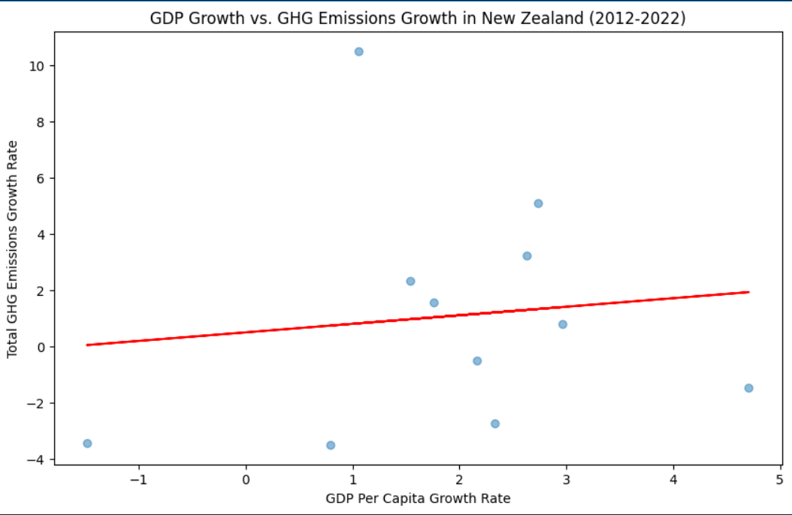
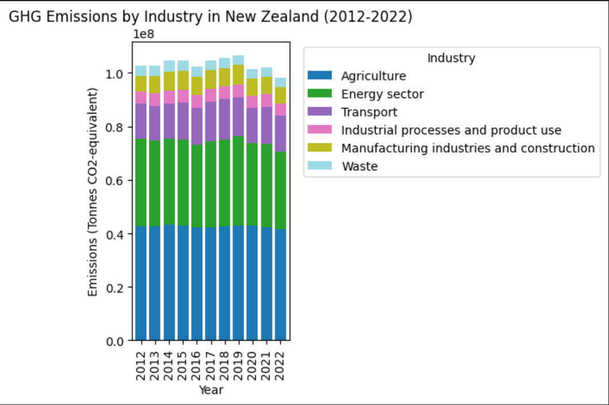

# Decision & Sustainability Analytics  
## Emissions, Economy, and Urbanization (OECD & World Bank)

### Overview
This project analyses the relationship between greenhouse gas (GHG) emissions, economic growth, and urbanization using publicly available OECD and World Bank datasets. The analysis focuses on global patterns and a detailed comparison with New Zealand to support sustainability, policy, and evidence-based decision-making.

This project was completed as part of the Master of Business Analytics programme at the University of Auckland.

---

## Business Problem
Economic growth and urban expansion can increase environmental pressure, but the strength of this relationship varies across countries and industries. Policymakers and analysts need clear, data-driven evidence to understand whether emissions can be reduced without constraining economic growth.

This project examines:
- Whether GDP growth is strongly correlated with emissions growth
- Which industries contribute most to greenhouse gas emissions
- How New Zealand compares with global emissions–growth patterns

---

## Why This Matters
Understanding the relationship between emissions and economic growth helps decision-makers:
- Design effective sustainability and climate policies
- Identify sectors requiring targeted intervention
- Benchmark national performance against peer countries
- Support long-term low-emission economic growth

This type of analysis is commonly used in public-sector reporting, sustainability strategy, and policy advisory work.

---

## Data Sources
- **OECD Greenhouse Gas Emissions (AIR_GHG)** – multi-sector emissions data by country and year  
- **World Bank – GDP per capita growth**  
- **World Bank – Urban population (% of total)**  
- **Climate Policy Database** (referenced for policy comparison and future extension)

All datasets are publicly available and widely used in sustainability and policy research.

---

## Tools Used
- Python (Pandas, NumPy, Matplotlib, Seaborn)
- Jupyter Notebook
- Excel (data validation and sense-checking)

---

## Key Analytical Steps
- Audited and cleaned datasets from multiple international sources
- Standardised indicators to ensure consistent comparison
- Reshaped data into analysis-ready formats
- Merged emissions, GDP, and urbanization data by country and year
- Conducted correlation analysis at global and New Zealand levels
- Analysed sector-level emissions trends
- Benchmarked New Zealand against global and developed-country averages

---

## Key Insights
- New Zealand shows a **weak correlation** between GDP growth and emissions, indicating partial decoupling
- Globally, **transport and energy sectors** show the strongest linkage between economic growth and emissions
- **Agriculture** remains the largest emissions contributor in New Zealand, with weaker GDP linkage
- Economic growth does not automatically imply proportional emissions growth

---

## Key Visual Insights

### GDP Growth vs Emissions (New Zealand)

This chart shows a weak relationship between GDP growth and greenhouse gas emissions in New Zealand, suggesting that economic growth has not translated into proportionally higher emissions.

---

### Global Industry-Level Emissions

This comparison highlights that energy, transport, and manufacturing sectors are the largest contributors to global greenhouse gas emissions, with transport showing the strongest association with economic activity.

---

## Decisions This Analysis Supports
- Sustainability and climate policy planning
- Sector-focused emissions reduction strategies
- Public investment and infrastructure prioritisation
- International benchmarking and reporting

---

## Files in This Repository
- `sustainability_analysis.ipynb` – Python notebook containing the full analysis workflow  
- `presentation_slides.pdf` – Project presentation summarising key findings  
- `nz_gdp_vs_emissions.png` – Key visual comparing GDP growth and emissions in New Zealand  
- `global_industry_emissions.png` – Global industry-level emissions comparison  

---

## Skills Demonstrated
- Data cleaning and integration  
- Exploratory and comparative analysis  
- Sustainability and policy analytics  
- Visual insight communication  
- Structured analytical thinking

---

## Notes
This repository is intentionally kept simple and readable. The focus is on analytical reasoning, data quality, and insight communication rather than complex code structures.
